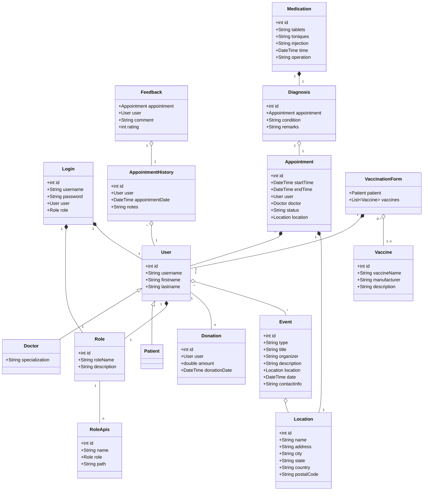

# CodeCare

## Project Description

CodeCare is an innovative health management platform designed to streamline various aspects of
healthcare services for users. With a focus on providing comprehensive care solutions, CodeCare
addresses critical areas such as user registration, donations, vaccination management, appointment
bookings, and medical history maintenance. Each component of CodeCare is meticulously crafted to
enhance user experience and facilitate efficient healthcare interactions.

## Features

- **User Registration:**
  A seamless and secure registration process ensures that users can easily create accounts on the
  CodeCare platform. This foundational feature lays the groundwork for personalized healthcare
  services tailored to individual needs.

- **Donation:**
  CodeCare empowers users to contribute to healthcare initiatives through a dedicated donation
  system. This feature facilitates philanthropic endeavors, enabling users to
  support various healthcare projects and initiatives.

- **Vaccination Management:**
  Comprehensive vaccination management system.
  Users can access information regarding vaccinations, schedule appointments, and receive reminders
  for upcoming immunizations, promoting proactive healthcare practices.

- **Appointment Bookings:**
  Appointment booking system on CodeCare, ensuring users can conveniently
  schedule medical appointments with healthcare providers. This feature optimizes healthcare
  accessibility by simplifying the process of securing appointments for consultations, examinations,
  and treatments.

- **Medical History Maintenance:**
  Medical history maintenance module, a vital
  component that centralizes users' health records and past medical encounters. This feature
  includes functionalities such as medication reminders, enabling users to manage their treatment
  regimens effectively. Additionally, CodeCare incorporates general health checkup reminders to
  promote preventive healthcare practices and regular screenings.

- **Events:**
  The "Events" module in our health website provides a centralized platform for users to access 
  and engage with various healthcare events such as blood donation camps, free health checkups, 
  vaccination drives,etc. Users can explore upcoming events and access 
  essential information regarding the events. Through this module, we aim to promote proactive 
  health management and community participation in critical healthcare initiatives.

## Contributors

- Gokulakrishnan R - r.go@northeastern.edu
- Yakgna Venkatesh Ramasamy - ramasamy.y@northeastern.edu
- George Chempumthara - chempumthara.g@northeastern.edu
- Badrinath Rohith Varma Datla - datla.b@northeastern.edu

# Object Model

